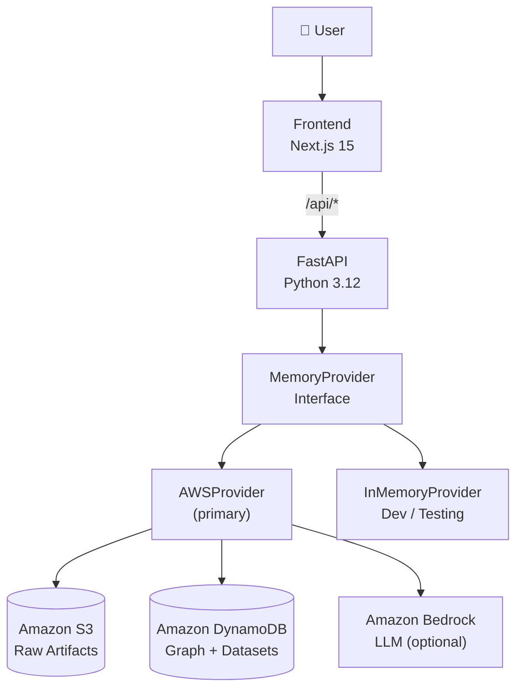
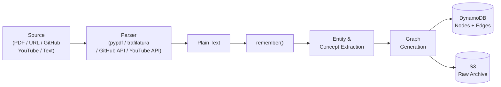
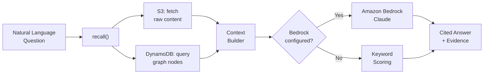
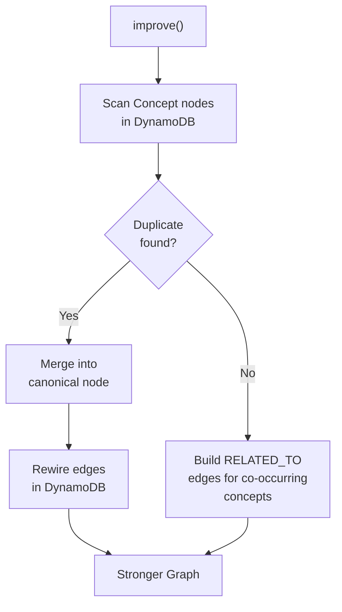
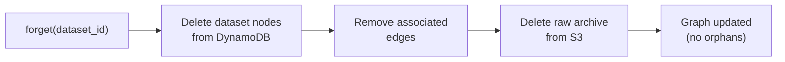
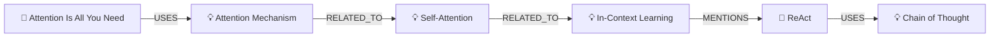

# AEGIS

**Context Memory AI — built on AWS**

> *Ingest anything. Remember everything. Query in plain language.*

---

## What It Is

AEGIS is a context memory system for AI applications. It ingests raw content — documents, URLs, PDFs, GitHub repositories, YouTube transcripts, research notes — extracts concepts and relationships, and stores a **persistent knowledge graph** on AWS. You query it in natural language and get cited, grounded answers.

The core idea:

```
Traditional RAG          AEGIS
─────────────            ─────
Question                 Question
  → Retrieve chunks        → Memory
  → LLM                    → Graph Traversal
  → Answer                 → Relationship Discovery
                           → LLM (optional)
                           → Cited Answer
```

Memory is not a feature. **Memory is the infrastructure.**

---

## AWS Infrastructure (Zero Cost)

AEGIS runs entirely on **AWS Free Tier** services — no servers, no clusters, no VPCs.

| Service | Role | Cost |
|---|---|---|
| **Amazon S3** | Raw artifact archival (text, PDFs, transcripts) | Free (5 GB / 12 months) |
| **Amazon DynamoDB** | Persistent knowledge graph + dataset registry | **Always free** (25 GB forever) |
| **Amazon Bedrock** | Optional LLM answer synthesis (Claude) | Pay-per-token (~$0.001/query) |

DynamoDB tables are created automatically on first run with `PAY_PER_REQUEST` billing. No provisioning, no idle costs.

---

## Architecture



Every backend implements the same `MemoryProvider` interface — the API and frontend are completely decoupled from the storage layer.

---

## Memory Lifecycle

### Ingestion — `remember()`



### Retrieval — `recall()`



### Graph Optimization — `improve()`



### Deletion — `forget()`



---

## Features

| Feature | Description |
|---|---|
| **Multi-source ingestion** | PDF, URL, Markdown/TXT, GitHub README, YouTube transcript, raw text |
| **Persistent memory** | Knowledge graph stored in DynamoDB — survives server restarts |
| **Raw archival** | Source content archived to S3 for full-text recall |
| **Research Chat** | Natural language Q&A backed by graph traversal |
| **Graph Explorer** | Interactive knowledge graph visualization |
| **Memory Manager** | Full lifecycle — remember, improve, forget |
| **Dashboard** | Live stats — nodes, edges, datasets, memory quality score |
| **Bedrock upgrade** | One env var to switch from keyword to Claude-powered answers |

---

## Tech Stack

### Frontend
| Tool | Role |
|---|---|
| Next.js 15 | App framework (App Router) |
| TypeScript | Type safety |
| Tailwind CSS | Styling |
| TanStack Query | Server-state + polling |
| React Flow | Knowledge graph visualization |
| Zustand | UI state |
| Lucide React | Icons |

### Backend
| Tool | Role |
|---|---|
| FastAPI | REST API framework |
| Python 3.12 | Runtime |
| Pydantic v2 | Schema validation + settings |
| uv | Dependency management |
| pypdf | PDF text extraction |
| trafilatura | URL / article extraction |
| youtube-transcript-api | YouTube transcript fetching |
| httpx | GitHub README fetching |

### AWS Infrastructure
| Service | Role |
|---|---|
| Amazon S3 | Raw artifact storage |
| Amazon DynamoDB | Knowledge graph + dataset registry |
| Amazon Bedrock | LLM answer synthesis (optional) |
| boto3 | AWS SDK for Python |

---

## Knowledge Graph Schema

**Node Types**

`Note` · `Concept` · `Paper` · `Author` · `Organization` · `Method` · `Dataset` · `Repository`

**Relationship Types**

`MENTIONS` · `RELATED_TO` · `AUTHORED_BY` · `USES` · `REFERENCES` · `EXTENDS` · `SUPPORTS` · `CONTRADICTS`

**Example graph fragment:**



---

## Quick Start

### 1. AWS setup (one time)

**Create an IAM user** with these permissions:

```json
{
  "Version": "2012-10-17",
  "Statement": [
    {
      "Effect": "Allow",
      "Action": [
        "s3:PutObject", "s3:GetObject", "s3:DeleteObject",
        "s3:ListBucket", "s3:HeadBucket", "s3:CreateBucket"
      ],
      "Resource": [
        "arn:aws:s3:::aegis-memory-*",
        "arn:aws:s3:::aegis-memory-*/*"
      ]
    },
    {
      "Effect": "Allow",
      "Action": [
        "dynamodb:CreateTable", "dynamodb:DescribeTable",
        "dynamodb:PutItem", "dynamodb:GetItem", "dynamodb:DeleteItem",
        "dynamodb:Scan", "dynamodb:Query", "dynamodb:BatchWriteItem"
      ],
      "Resource": "arn:aws:dynamodb:*:*:table/aegis-*"
    }
  ]
}
```

Add `"bedrock:InvokeModel"` to the policy if you want Claude-powered answers.

### 2. Configure

```bash
# Copy and fill in your AWS credentials
cp server/.env.example server/.env
```

Edit `server/.env`:

```env
MEMORY_BACKEND=aws
AWS_REGION=us-east-1
AWS_ACCESS_KEY_ID=<your-access-key>
AWS_SECRET_ACCESS_KEY=<your-secret-key>
S3_BUCKET=aegis-memory-<your-account-id>   # globally unique

# Optional — enable Claude answers:
# BEDROCK_MODEL_ID=anthropic.claude-3-haiku-20240307-v1:0
```

### 3. Install and run

```bash
# Backend
cd server
uv sync --extra aws
uv run uvicorn app.main:app --reload --port 8000

# Frontend (separate terminal)
cd client
npm install
npm run dev    # http://localhost:3000
```

DynamoDB tables and the S3 bucket are created automatically on first start.

### Local dev (no AWS)

```bash
# Zero infrastructure — in-process memory only
MEMORY_BACKEND=memory uv run uvicorn app.main:app --reload --port 8000
```

---

## API Reference

| Method | Endpoint | Operation |
|---|---|---|
| `POST` | `/api/sources/text` | Ingest text / markdown / notes |
| `POST` | `/api/sources/url` | Ingest a web article |
| `POST` | `/api/sources/pdf` | Ingest a PDF (multipart upload) |
| `POST` | `/api/sources/github` | Ingest a GitHub repository README |
| `POST` | `/api/sources/youtube` | Ingest a YouTube transcript |
| `POST` | `/api/memory/recall` | Query memory, get a cited answer |
| `POST` | `/api/memory/improve` | Optimize the knowledge graph |
| `DELETE` | `/api/memory/forget` | Delete a dataset and its graph nodes |
| `GET` | `/api/datasets` | List all stored datasets |
| `GET` | `/api/graph` | Get nodes + edges for visualization |
| `GET` | `/api/stats` | Memory statistics |
| `GET` | `/api/health` | Backend health check (S3 + DynamoDB status) |

Interactive docs: `http://localhost:8000/docs`

---

## Deployment

| Service | Platform | Notes |
|---|---|---|
| Backend | Railway / Render / Fly.io | Set env vars from `server/.env` |
| Frontend | Vercel | Set `NEXT_PUBLIC_API_URL` to backend URL |
| Storage | AWS (S3 + DynamoDB) | Configured via env vars — no separate infra to deploy |

The AWS backend requires no managed services beyond S3 and DynamoDB. There is nothing to provision, patch, or scale.

---

## Scaling Up

When keyword recall is no longer sufficient, enable Bedrock with a single env var:

```env
BEDROCK_MODEL_ID=anthropic.claude-3-haiku-20240307-v1:0
```

No code changes needed. The `AWSProvider` detects the model ID at startup and upgrades recall from keyword scoring to full LLM synthesis.

For larger datasets, the same provider interface supports swapping DynamoDB for Neptune (graph) and OpenSearch Serverless (vector) — zero changes to the API or frontend.
