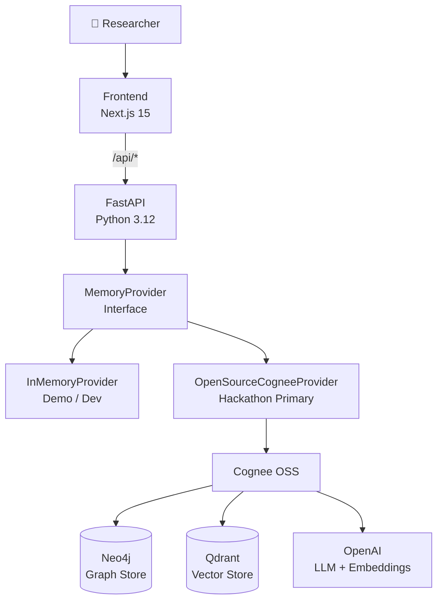
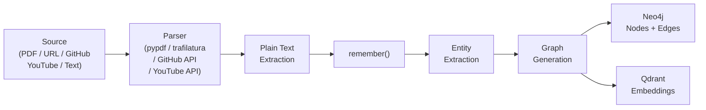
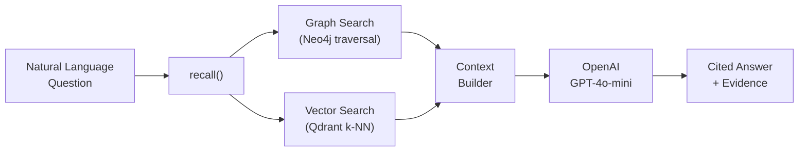
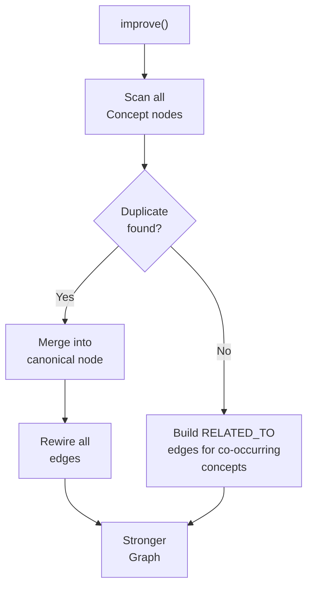
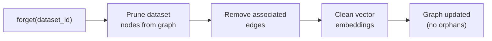
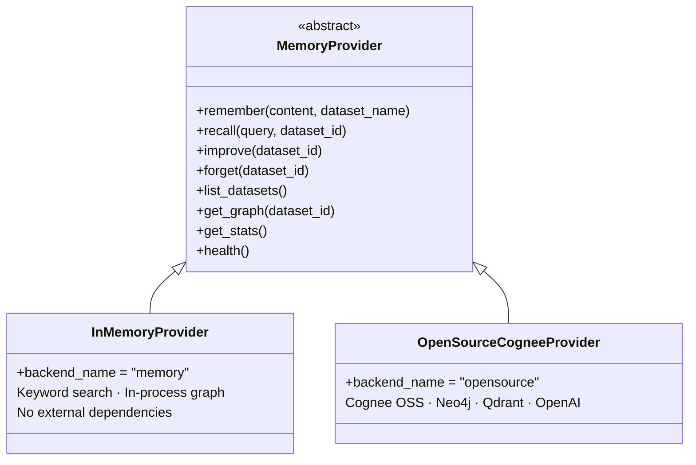
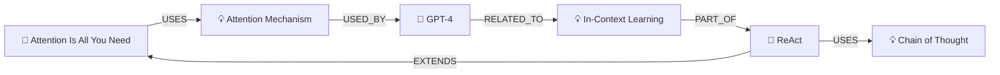

# AEGIS

**Memory Operating System for AI Research**

> *Research Once. Remember Forever.*

---

## The Problem

AI researchers drown in information. They read hundreds of papers, clone repositories, watch conference talks, and write experiment notes — then lose everything to scattered files, dead bookmarks, and fading memory.

**Existing tools don't help.**

- Search engines return pages, not knowledge.
- RAG systems retrieve snippets, not relationships.
- Note-taking apps store text, not meaning.

When a researcher asks *"How have agent architectures evolved over the past two years?"*, they need a system that **remembers** — one that has read everything they've given it, built a map of concepts and relationships, and can reason across all of it.

That system doesn't exist. **AEGIS builds it.**

---

## The Solution

AEGIS is a **Memory-Native Research Operating System**. It transforms raw research artifacts — papers, repositories, documentation, notes, videos — into a continuously evolving **knowledge graph** that can be queried in plain language.

The core insight is simple:

```
Traditional RAG          AEGIS
─────────────            ─────
Question                 Question
  → Retrieval              → Memory
  → LLM                    → Graph Traversal
  → Answer                 → Relationship Discovery
                           → Temporal Reasoning
                           → LLM
                           → Cited Answer
```

Memory is not a feature. **Memory is the product.**

Built on the [Cognee](https://github.com/topoteretes/cognee) memory lifecycle — `remember`, `recall`, `improve`, `forget` — AEGIS demonstrates how persistent memory can become the foundation layer for AI research systems.

---

## Goals

1. Store research artifacts as **structured memory**, not raw files
2. Build a **living knowledge graph** that grows with every ingestion
3. Enable **natural language queries** across the entire graph
4. Support **memory improvement** — merging duplicates, strengthening relationships
5. Support **controlled deletion** — remove obsolete datasets cleanly
6. Remain **backend-agnostic** — swap Cognee, Neo4j, or Qdrant without touching business logic
7. Deploy anywhere — no Docker lock-in, works on Railway, Render, Vercel

---

## Features

| Feature | Description |
|---|---|
| **Multi-source ingestion** | PDF, URL, Markdown/TXT, GitHub README, YouTube transcript, raw notes |
| **Memory graph** | Every ingested source becomes nodes and edges in a queryable knowledge graph |
| **Research Chat** | Natural language Q&A backed by graph traversal + semantic search |
| **Graph Explorer** | Interactive visualization of the knowledge graph with React Flow |
| **Memory Manager** | Full CRUD over datasets — remember, improve, forget |
| **Timeline** | Chronological view of every memory operation |
| **Dashboard** | Live stats — nodes, edges, datasets, memory quality score |
| **Swappable backends** | `InMemoryProvider` for demos, `OpenSourceCogneeProvider` for production |
| **Deploy-ready** | Vercel + Railway/Render — no Docker required |

---

## How It Works

### High-Level Architecture



The application **never** imports Cognee directly in business logic. Every interaction goes through the `MemoryProvider` interface, which means backends are fully swappable by changing one environment variable.

---

### Ingestion Pipeline — `remember()`



Each source type has a dedicated parser. The parser's only job is to produce clean text — all graph intelligence happens inside `remember()`.

---

### Retrieval Pipeline — `recall()`



Recall combines **structural graph traversal** (who cites whom, what method is used by which paper) with **semantic vector search** (concepts near the query embedding). The LLM synthesizes a grounded answer from both.

---

### Memory Improvement — `improve()`



`improve()` runs as a background optimization — it finds near-duplicate concepts (e.g. "LLM" and "Large Language Model"), merges them into a single canonical node, and creates new relationships between concepts that appear in the same dataset. The graph gets denser and more accurate with every run.

---

### Forget Pipeline — `forget()`



Deletion is **controlled and clean**. Only nodes exclusively owned by the target dataset are removed. Shared concept nodes (referenced by other datasets) are preserved.

---

### The Provider Abstraction



New backends (AWS Bedrock + Neptune + OpenSearch is planned) implement the same interface — **zero changes to the API, frontend, or business logic**.

---

## Tech Stack

### Frontend
| Tool | Role |
|---|---|
| Next.js 15 | App framework (App Router) |
| TypeScript | Type safety across the entire client |
| Tailwind CSS | Styling |
| TanStack Query | Server-state management + polling |
| React Flow | Interactive knowledge graph visualization |
| Zustand | UI state |
| Lucide React | Icons |

### Backend
| Tool | Role |
|---|---|
| FastAPI | REST API framework |
| Python 3.12 | Runtime |
| Pydantic v2 | Schema validation + settings |
| uv | Dependency management |
| pypdf | PDF text extraction |
| trafilatura | Web article extraction |
| youtube-transcript-api | YouTube transcript fetching |
| httpx | GitHub README fetching |

### Memory Infrastructure
| Tool | Role |
|---|---|
| Cognee OSS | Memory lifecycle orchestration |
| Neo4j | Graph store (nodes + relationships) |
| Qdrant | Vector store (semantic embeddings) |
| OpenAI GPT-4o-mini | LLM for answer synthesis |
| OpenAI text-embedding-3-small | Embedding generation |

### Infrastructure
| Tool | Role |
|---|---|
| Docker + Docker Compose | Local Neo4j + Qdrant (optional) |
| Railway / Render / Fly.io | Backend deployment |
| Vercel / Netlify | Frontend deployment |

---

## Knowledge Graph Schema

**Node Types**

`Paper` · `Author` · `Organization` · `Research Area` · `Concept` · `Method` · `Dataset` · `Benchmark` · `Repository` · `Experiment` · `Claim` · `Note`

**Relationship Types**

`AUTHORED_BY` · `USES` · `IMPROVES` · `REFERENCES` · `RELATED_TO` · `SUPPORTS` · `CONTRADICTS` · `GENERATED_FROM` · `PART_OF` · `EXTENDS` · `MENTIONS` · `DISCUSSES`

**Example graph fragment:**



---

## Quick Start

### No-infra demo (InMemory backend)

```bash
# 1. Backend
cd server
cp .env.example .env          # MEMORY_BACKEND=memory (default)
uv sync
uv run uvicorn app.main:app --reload --port 8000

# 2. Frontend (separate terminal)
cd client
npm install
npm run dev                   # http://localhost:3000
```

Everything works immediately — no API keys, no Docker, no databases.

### Full Cognee stack (Neo4j + Qdrant + OpenAI)

```bash
# 1. Start stores
docker compose up -d          # Neo4j (7474/7687) · Qdrant (6333)

# 2. Configure
cp server/.env.example server/.env
# Set: MEMORY_BACKEND=opensource  LLM_API_KEY=sk-...

# 3. Run backend + frontend (same as above)
```

### Deploy (no Docker)

| Service | Platform | Notes |
|---|---|---|
| Backend | Railway / Render | Set env vars from `server/.env` |
| Frontend | Vercel | Set `NEXT_PUBLIC_API_URL` to backend URL |
| Graph store | [Neo4j Aura](https://neo4j.com/cloud/aura/) | Free tier (1 GB) |
| Vector store | [Qdrant Cloud](https://cloud.qdrant.io/) | Free tier (1 GB) |

---

## API Reference

| Method | Endpoint | Operation |
|---|---|---|
| `POST` | `/api/sources/text` | Remember text / markdown / notes |
| `POST` | `/api/sources/url` | Remember a web article |
| `POST` | `/api/sources/pdf` | Remember a PDF (multipart upload) |
| `POST` | `/api/sources/github` | Remember a GitHub repository README |
| `POST` | `/api/sources/youtube` | Remember a YouTube transcript |
| `POST` | `/api/memory/recall` | Query memory, get a cited answer |
| `POST` | `/api/memory/improve` | Optimize the knowledge graph |
| `DELETE` | `/api/memory/forget` | Delete a dataset and its graph nodes |
| `GET` | `/api/datasets` | List all stored datasets |
| `GET` | `/api/graph` | Get nodes + edges for visualization |
| `GET` | `/api/stats` | Memory statistics |
| `GET` | `/api/health` | Backend health check |

Interactive docs available at `http://localhost:8000/docs`.

---

## Hackathon Demo Script

1. **Backend** → Settings page confirms provider is healthy
2. **Upload** → Remember: *Attention Is All You Need*, *ReAct*, *DSPy*, *MCP Docs*, *LangGraph Docs*
3. **Graph Explorer** → Show the populated knowledge graph
4. **Chat** → Ask: *"What concepts connect these documents?"*
5. **Improve** → Run `improve()`, refresh graph — watch new edges appear
6. **Chat** → Ask: *"How have AI agents evolved?"*
7. **Forget** → Delete one dataset, refresh graph — nodes pruned cleanly

---

## Future Scope — AWS Provider

The provider interface makes adding a production-scale AWS backend straightforward:

| Current | AWS Equivalent |
|---|---|
| OpenAI | Amazon Bedrock (Claude / Titan) |
| Neo4j | Amazon Neptune |
| Qdrant | Amazon OpenSearch Serverless |
| — | Amazon S3 (raw artifact storage) |

Switching requires: implement `AWSProvider(MemoryProvider)`, set `MEMORY_BACKEND=aws`. Zero changes to the API or frontend.

---

*Built for the Cognee Hackathon — track: Best Open Source Cognee Project.*
